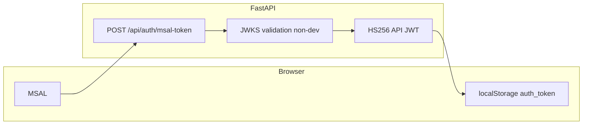

# Security risk assessment (pre–security team review)

**Product:** Zenith HR Pulse  
**Stack:** React / MSAL (frontend), FastAPI on ECS (backend), DynamoDB, KMS field encryption, S3, Bedrock  
**Scope:** Assessment of risks observed in the codebase and architecture — **not** a penetration test. Validate each item in the target environment (staging vs production may differ on `ENVIRONMENT`, secrets, and network controls).

**Remediation backlog (track separately):**

| ID | Task |
|----|------|
| verify-prod-env | Confirm `ENVIRONMENT`, `CORS_ORIGINS`, JWT/MSAL secrets in staging/prod (no dev MSAL bypass, no default `SECRET_KEY`) |
| harden-public-endpoints | Auth-guard or remove `/api/*/admins/test`, `/api/routes-debug`, public admin check by email, verbose health/version endpoints |
| reduce-sensitive-logging | Remove DEBUG prints of tokens; redact PII in CloudWatch (`get_current_user`, JWKS, `msal-token`) |
| xss-review | Audit `EmployeeCard` `innerHTML` and user-derived HTML; add CSP headers if required |
| rate-limit-waf | Add WAF/rate limits on auth and expensive GET endpoints |
| dependency-audit | Run `pip`/`npm` audit; evaluate `python-jose` vs PyJWT policy |

---

## 1. Authentication and session management

| Risk | Detail | Where to look |
|------|--------|----------------|
| **Backend JWT (HS256) after MSAL** | After Azure AD login, the API issues its own JWT via `create_access_token` using `SECRET_KEY` and **HS256** (`backend/app/security.py`). Compromise of `SECRET_KEY` or weak/default secrets allows forging tokens. | `SECRET_KEY = config.get("security.secret_key", "your-secret-key-for-development")` — ensure production uses a **strong, rotated secret** from Secrets Manager/SSM, never the default. |
| **MSAL exchange — dev bypass** | When `ENVIRONMENT` is `development`/`dev`/`local`, `/api/auth/msal-token` uses **unverified** MSAL claims (`backend/app/routers/auth.py`, ~lines 112–119). | **Critical:** Confirm staging/prod `ENVIRONMENT` is **not** dev; otherwise anyone can post a fake MSAL token blob. |
| **Token lifetime** | `ACCESS_TOKEN_EXPIRE_MINUTES = 480` (8 hours) in `security.py`. | Align with org policy; consider shorter TTL + refresh. |
| **Password grant still present** | `/api/auth/token` and `/api/auth/login` use mock/basic user store (`auth.py`, `models.py`). | If exposed publicly, increases attack surface (credential stuffing, brute force). Consider **disabling or IP-restricting** if unused in prod. |
| **Frontend token storage** | `auth_token` in **localStorage** (`src/pages/Login.tsx`, `src/utils/auth-utils.ts`). | Any **XSS** can exfiltrate tokens. Mitigate with CSP, sanitization, dependency audits; consider httpOnly cookies + backend session if policy requires. |

### Auth flow (high level)

---

## 2. Authorization and information disclosure

| Risk | Detail |
|------|--------|
| **Public admin enumeration** | `GET /api/auth/admins/check/{email}` and routes under `/api/admins/check/{email}` return whether an email is admin **without authentication** (`auth.py`, `admin.py`). Enables **account/admin role enumeration**. |
| **Public test and health endpoints** | e.g. `/api/auth/admins/test`, `/api/auth/health`, `/api/admins/test` expose **DynamoDB table names**, internal messages, and endpoint lists. |
| **Debug / recon endpoints** | `/api/routes-debug`, `/api/version-check` in `main.py` expose routing and deployment metadata. Restrict behind auth, IP allowlist, or remove in production. |
| **Broad CORS** | `main.py`: `allow_methods=["*"]`, `allow_headers=["*"]` with explicit origins from `CORS_ORIGINS`. Ensure **only** trusted frontends; avoid wildcards with credentials. |
| **IDOR / role checks** | Most business routes use `Depends(get_current_active_user)`; admin flag from DynamoDB admins table. Pentesters should verify **every** sensitive action checks **role** and **scoping**, not only “valid JWT”. |

---

## 3. Logging, secrets, and operational leakage

| Risk | Detail |
|------|--------|
| **Sensitive logs** | `get_current_user` prints token prefix and debug lines (`security.py`). JWKS validator logs unverified token claims (aud, iss, tid). MSAL exchange logs user context. Risk of **PII in CloudWatch**; use structured, redacted logs in prod. |
| **Config loading** | `backend/app/config/config.py` prints DEBUG paths and can print loaded YAML. Ensure **no secrets** in committed `config.yaml`. |
| **Static uploads** | `main.py` mounts `./uploads` if present. Ensure not world-readable with sensitive files on ECS tasks. |

---

## 4. Data protection (DynamoDB / KMS / PII)

| Item | Detail |
|------|--------|
| **Field-level encryption** | Optional via `DYNAMODB_FIELD_ENCRYPTION_ENABLED` + KMS ARN; allowlist in `field_crypto.py`. Many attributes remain **plaintext** by design (names, departments, query keys). Map **which PII** is encrypted vs not against policy. |
| **Encryption in transit** | API behind **HTTPS** (ALB); review TLS policy and certificate management. |
| **Backfill / revert scripts** | Scripts under `backend/app/scripts/` can touch all rows — protect **who can run** them and audit. |

---

## 5. Application security (injection, XSS, SSRF)

| Risk | Detail |
|------|--------|
| **XSS** | `EmployeeCard.tsx` assigns `parent.innerHTML` with template strings — if any fragment is user-controlled, **XSS** is possible. `components/ui/chart.tsx` uses `dangerouslySetInnerHTML`; verify inputs. |
| **AI / Bedrock** | Prompts built from employee/job data (`bedrock_service.py`, AI routers). Risk of **prompt injection** and **data leakage to model logs** — review Bedrock logging and IAM. |
| **File uploads** | Employee/review flows use `UploadFile` — verify **size limits, content types**, and S3 bucket policies (private, no public ACL). |
| **DynamoDB** | Lower SQLi risk than RDBMS — still validate **input size** and **authorization** on all keys. |

---

## 6. Denial of service and abuse

| Finding | Detail |
|---------|--------|
| **No app-level rate limiting** | No global rate limits on `/api/auth/*` or heavy scans. **Brute force** on password endpoints and **cost abuse** (large `limit` on employees) possible. Consider ALB/WAF or API Gateway limits. |
| **Expensive reads** | Full table scans for large `limit` — can be abused for **DoS**; partially mitigated by caps and early-exit in code. |

---

## 7. Dependencies and supply chain

- **Python:** `python-jose`, `passlib`, `requests` — pin versions; track **CVEs** (some teams prefer `PyJWT` + explicit algorithms).
- **npm:** Run `npm audit` / Dependabot for the Vite/React tree.

---

## 8. Infrastructure (AWS)

- **ECS/Fargate:** Task IAM roles — **least privilege** (DynamoDB, KMS, S3, Bedrock only as needed).
- **KMS:** CMK for field encryption — key policy and rotation.
- **Secrets:** JWT secret, Azure `AZURE_MSAL_*` — **not** in git; use Secrets Manager/Parameter Store.
- **Network:** Security groups — API not unnecessarily open beyond ALB.

---

## 9. Login performance vs security

Login flow changes **removed blocking** full-table employee/dashboard calls from `Login.tsx`; auth still does Graph + `/msal-token` + feature flags. That improves **latency** without a new auth bypass by itself — but **ensure** production never enables dev MSAL bypass and that **HTTPS + correct CORS** are enforced end-to-end.

---

## Recommended deliverables for the security team

1. **Threat model:** browser → CloudFront/S3 (static) → ALB → ECS → DynamoDB/KMS/S3/Bedrock.
2. **Checklist:** authenticate admin/debug routes; remove or protect enumeration endpoints; secret management; WAF/rate limits; XSS review on `innerHTML`; pentest IDOR on employee/review IDs.
3. **Config verification:** `ENVIRONMENT`, `CORS_ORIGINS`, `security.secret_key`, `DYNAMODB_FIELD_ENCRYPTION_*`, Azure tenant/client IDs.

---

*Document generated from internal security review. Update as remediation items are completed.*
