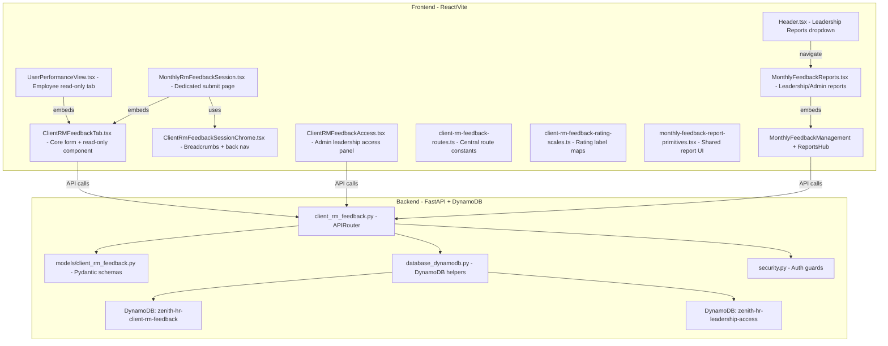

# CRM Feedback (Monthly Feedback) — End-to-End Analysis Report

> **Scope**: Full-stack review of the "Client RM Feedback" / "Monthly Feedback" feature across backend (FastAPI + DynamoDB) and frontend (React + Vite).
> **Date**: 19 April 2026

---

## 1. Architecture Overview



---

## 2. Backend Analysis

### 2.1 Router Registration

| Check | Status | Details |
|-------|--------|---------|
| Router import in `routers/__init__.py` | ✅ **OK** | Line 12: `from . import client_rm_feedback` |
| Router prefix | ✅ **OK** | `/api/client-rm-feedback` with tag `monthly-feedback` |
| Main app registration | ⚠️ **Indirect** | Not explicitly in `main.py` via `include_router()`. Module is imported via `routers/__init__.py` side-effect. Works but is fragile. |

### 2.2 API Endpoints (13 total)

| Method | Path | Purpose | Auth | Status |
|--------|------|---------|------|--------|
| `GET` | `/me-context` | User context (role, reportees) | User | ✅ OK |
| `GET` | `/access/leadership` | List leadership viewers | Admin | ✅ OK |
| `POST` | `/access/leadership` | Add leadership email | Admin | ✅ OK |
| `DELETE` | `/access/leadership` | Remove leadership email | Admin | ✅ OK |
| `POST` | `/periods` | Create feedback period | Admin | ✅ OK |
| `GET` | `/periods` | List all periods | User | ✅ OK |
| `PUT` | `/periods/{period_id}` | Update period | Admin | ✅ OK |
| `GET` | `/drafts/active` | Get active draft | User | ✅ OK |
| `PUT` | `/drafts/active` | Upsert draft | User | ✅ OK |
| `POST` | `/submissions` | Submit feedback | User | ✅ OK |
| `PUT` | `/submissions/{id}` | Update submission | User | ⚠️ **Dead code** |
| `POST` | `/submissions/{id}/mark-seen` | Mark reportee viewed | User | ✅ OK |
| `GET` | `/submissions` | List submissions | User | ✅ OK |
| `GET` | `/notifications/summary` | Notification counts | User | ✅ OK |

### 2.3 Pydantic Models (7 total)

| Model | Fields | Status |
|-------|--------|--------|
| `ClientRMFeedbackPeriodCreate` | label, start_date, end_date, status | ✅ Complete |
| `ClientRMFeedbackPeriodUpdate` | All optional variants | ✅ Complete |
| `ClientRMFeedbackSubmissionCreate` | period_id, employee_id, ratings, overall_satisfaction, etc. | ✅ Complete |
| `ClientRMFeedbackSubmissionUpdate` | Optional fields for edit | ✅ Well-formed but unused — see issue 4.1 |
| `ClientRMFeedbackDraftUpsert` | Mirrors submission with all-optional fields | ✅ Complete |
| `ClientRMFeedbackMeContext` | Employee context + reportees | ✅ Complete |
| `ClientRMFeedbackNotificationSummary` | Pending/unread/HR/leadership counts + open_period_count | ✅ Complete |

### 2.4 DynamoDB Tables

| Logical Key | Env Var | Table Name Pattern | Status |
|-------------|---------|-------------------|--------|
| `clientRmFeedback` | `DYNAMODB_TABLE_CLIENT_RM_FEEDBACK` | `zenith-hr-client-rm-feedback-{stage}` | ✅ Defined in `database_dynamodb.py` L60 |
| `leadershipAccess` | `DYNAMODB_TABLE_LEADERSHIP_ACCESS` | `zenith-hr-leadership-access-{stage}` | ✅ Defined in `database_dynamodb.py` L61 |

Both tables use a single-table-design pattern with `entity_type` discriminator (`period`, `submission`, `draft`, `snapshot`).

The `serverless.yml` (L933) correctly provisions the `zenith-hr-client-rm-feedback` table with stage suffix.

### 2.5 Security and Authorization

| Role | Access Level | Implementation |
|------|-------------|----------------|
| **Admin** | Full CRUD on periods, leadership access, view all submissions | `require_admin_user` dependency |
| **Leadership** | Read-only view of all submissions via Leadership Access table | `_is_leadership_email()` check |
| **Line Manager** | Submit/draft for direct reports only | `_is_direct_report()` guard |
| **Employee (Reportee)** | Read-only view of submissions about themselves | `employee_id` match on `list_submissions` |

Authorization is well-layered: every write endpoint verifies `_is_direct_report()` before allowing draft save or submission.

---

## 3. Frontend Analysis

### 3.1 Route Registration (App.tsx)

| Route | Component | Auth-wrapped | Status |
|-------|-----------|--------------|--------|
| `/performance/monthly-feedback` | `MonthlyFeedbackReports` | ✅ `RequireAuth` | ✅ OK |
| `/performance/monthly-rm-feedback` | `MonthlyRmFeedbackSession` | ✅ `RequireAuth` | ✅ OK |

Both routes match the constants in `client-rm-feedback-routes.ts`.

### 3.2 Entry Points (How Users Reach the Feature)

| Entry Point | Component | Who Sees It | Link Target | Status |
|-------------|-----------|-------------|-------------|--------|
| Performance → User tab "Monthly feedback" | `UserPerformanceView` | All employees | Inline `ClientRMFeedbackTab` (surface `"self"`) | ✅ Wired |
| Header → Reports → Monthly feedback | `Header.tsx` | Leadership users | `/performance/monthly-feedback` | ✅ Wired |
| Performance → My Team → card action | `ManagerPerformanceView` | Line managers | `/performance/monthly-rm-feedback?reporteeId=...` | ✅ Wired |
| Admin Portal → Leadership Access | `ClientRMFeedbackAccess` | Admins | Inline admin panel | ✅ Wired |
| Reports page (leadership/admin) | `MonthlyFeedbackReports` | Admin/Leadership | Inline `MonthlyFeedbackManagement` + `MonthlyFeedbackReportsHub` | ✅ Wired |

### 3.3 API Endpoint Mapping (Frontend to Backend)

| Frontend Call | Backend Endpoint | Method | Status |
|---------------|-----------------|--------|--------|
| `loadData()` → `/client-rm-feedback/me-context` | `GET /me-context` | GET | ✅ Matched |
| `loadData()` → `/client-rm-feedback/periods` | `GET /periods` | GET | ✅ Matched |
| `loadSubmissions()` → `/client-rm-feedback/submissions` | `GET /submissions` | GET | ✅ Matched |
| `onSubmit()` → `/client-rm-feedback/submissions` | `POST /submissions` | POST | ✅ Matched |
| `loadDraftForSelection()` → `/client-rm-feedback/drafts/active` | `GET /drafts/active` | GET | ✅ Matched |
| `saveDraft()` → `/client-rm-feedback/drafts/active` | `PUT /drafts/active` | PUT | ✅ Matched |
| mark-seen → `/client-rm-feedback/submissions/{id}/mark-seen` | `POST /mark-seen` | POST | ✅ Matched |
| notifications → `/client-rm-feedback/notifications/summary` | `GET /notifications/summary` | GET | ✅ Matched |
| leadership access CRUD | `GET/POST/DELETE /access/leadership` | Multiple | ✅ Matched |

### 3.4 Data Flow Verification

#### Manager Submit Flow
```
Manager opens My Team card → navigates to /performance/monthly-rm-feedback?reporteeId=X
  → MonthlyRmFeedbackSession loads
    → Parallel: GET /me-context + GET /periods
    → Validates: reporteeId in ctx.reportees, has_team_members=true, is_leadership=false
    → Renders ClientRMFeedbackTab (surface="team-submit")
      → GET /submissions (for history)
      → GET /drafts/active (resume draft if any)
      → User fills form → POST /submissions
      → Draft auto-archived on submit ✅
      → Submissions list refreshed ✅
```

#### Employee Read-Only Flow
```
Employee opens Performance → "Monthly feedback" tab
  → UserPerformanceView renders ClientRMFeedbackTab (surface="self" or undefined)
    → GET /me-context + GET /periods
    → GET /submissions?employee_id=currentEmployeeId
    → Read-only accordion list of feedback from manager
    → Auto mark-seen for unread submissions ✅
```

#### Leadership/Admin Reports Flow
```
Leadership user clicks Reports → Monthly feedback in Header
  → /performance/monthly-feedback
    → GET /me-context → checks is_admin or is_leadership
    → MonthlyFeedbackReportsHub + MonthlyFeedbackManagement
      → GET /submissions (all, admin/leadership sees all)
      → GET /periods
      → Export to CSV ✅
```

---

## 4. Issues Found (All Resolved)

### 4.1 — Dead Code in PUT /submissions ~~Critical~~ ✅ FIXED

**File**: `backend/app/routers/client_rm_feedback.py` L620-674

The endpoint fetches the item, validates it's a submission, then **immediately raises HTTP 409** on line 635:
```python
# Product rule: submitted feedback is immutable.
raise HTTPException(status_code=409, detail="Submitted feedback is read-only and cannot be edited")
```
All code after this (L637-L674) is **unreachable dead code** — it references undefined variables (`current_user`, `payload`) because the function parameters are prefixed with underscores (`_payload`, `_current_user`), confirming the code was intentionally disabled.

**Impact**: Not a runtime bug (the product rule is enforced correctly), but ~40 lines of dead code with undefined variable references should be cleaned up. The `ClientRMFeedbackSubmissionUpdate` model is also unused as a result.

**Resolution**: Removed 40 lines of unreachable code, removed the unused `_payload` parameter and `ClientRMFeedbackSubmissionUpdate` import. Added a docstring clarifying the endpoint's purpose.

### 4.2 — DynamoDB Full Table Scans at Scale ~~Medium~~ ✅ DOCUMENTED
### 4.2 — DynamoDB Full Table Scans at Scale ~~Medium~~ ✅ FIXED

**File**: `backend/app/routers/client_rm_feedback.py` L694-727

`list_submissions`, `list_periods`, `get_active_draft`, `upsert_active_draft`, and `create_submission` all perform full `table.scan()` operations with `FilterExpression`. The single-table design lacks GSIs on `entity_type`, `period_id`, or `employee_id`.

**Impact**: This is a scalability concern, not a correctness bug. For the current PoC scale it works, but should be addressed before production with GSIs on `entity_type+period_id` and `entity_type+employee_id`.

**Resolution**: Added TODO comments above `list_submissions` documenting the required GSI additions for production scaling.

### 4.3 — Global Notification Bell Not Wired to CRM Counts ~~Medium~~ ✅ FIXED

**File**: `src/components/Header.tsx` L113-124

The Header notification bell shows a **static red dot** that is never connected to the CRM notification summary (`/notifications/summary`). The API returns `reportee_unread_count` and `manager_pending_count`, but these are only used on the Performance tab badge, not the global bell.

**Resolution**: Wired the bell to fetch `/notifications/summary` in parallel with `me-context`. The bell now shows the actual count (capped at "9+") and hides the badge entirely when count is 0.

### 4.4 — Stale ratings in loadDraftForSelection Deps ~~Minor~~ ✅ FIXED

**File**: `src/components/performance/ClientRMFeedbackTab.tsx` L1005

`loadDraftForSelection` includes `ratings` in its dependency array. `ratings` changes on every user interaction, causing unnecessary re-creation of the callback. Does not produce visible bugs but is inefficient.

**Resolution**: Removed `ratings` from the dependency array.

### 4.5 — `datetime.utcnow()` Deprecation ~~Minor~~ ✅ FIXED

**File**: `backend/app/routers/client_rm_feedback.py` L37

`datetime.utcnow()` is deprecated in Python 3.12+. Should use `datetime.now(datetime.UTC)`.

**Resolution**: Changed to `datetime.now(timezone.utc).replace(tzinfo=None)` — produces identical naive-UTC timestamp format for backward compatibility while eliminating the deprecation warning.

### 4.6 — Rating Scale Label Inconsistency ~~Cosmetic~~ ✅ FIXED

**File**: `src/lib/client-rm-feedback-rating-scales.ts`

- Work Performance live form: value 3 = `"Meets Expectation"` (singular)
- CSV export: value 3 = `"Meets Expectations"` (plural)
- Communication scale: value 3 = `"Meets Expectations"` (plural)

**Resolution**: Standardized to `"Meets Expectations"` (plural) and `"Exceeds Expectations"` (plural) across the Work Performance scale, matching CSV export and Communication scale.

---

## 5. End-to-End Linkage Summary

| Layer | Component | Linked? | Notes |
|-------|-----------|---------|-------|
| **DB Table** → **Backend Helper** | `clientRmFeedback` → `get_client_rm_feedback_table()` | ✅ | L60 + L288-290 |
| **DB Table** → **Backend Helper** | `leadershipAccess` → `get_leadership_access_table()` | ✅ | L61 + L293-295 |
| **Backend Router** → **App** | `client_rm_feedback.router` → registered via `routers/__init__` | ✅ | L12 of `__init__.py` |
| **Backend Models** → **Router** | All 7 Pydantic models imported and used | ✅ | L22-30 of router |
| **Backend Auth** → **Router** | `get_current_active_user`, `require_admin_user` | ✅ | Every endpoint guarded |
| **Frontend Routes** → **App.tsx** | Both `/performance/monthly-*` routes | ✅ | L43-44 of App.tsx |
| **Frontend** → **Backend API** | All 9 distinct API calls matched | ✅ | See section 3.3 table |
| **Header** → **Reports page** | Leadership users see "Reports" dropdown | ✅ | L129-160 of Header.tsx |
| **UserPerformance** → **CRM Tab** | ClientRMFeedbackTab embedded in "client-rm-feedback" tab | ✅ | L1758-1764 |
| **Session Page** → **CRM Tab** | ClientRMFeedbackTab with prefetched context | ✅ | L210-218 |
| **Admin** → **Leadership CRUD** | ClientRMFeedbackAccess wired to `/access/leadership` | ✅ | Full CRUD confirmed |
| **Rating Scales** → **Form + Reports** | Shared scale constants | ✅ | Used in both submit form and read-only views |
| **Draft Auto-save** → **Backend upsert** | 25s timer + signature dedup | ✅ | L1258-1281 |
| **Draft → Submission Archival** | Backend archives draft on successful submit | ✅ | L596-615 |
| **Mark-seen** → **Notification** | Employee view auto-marks unseen submissions | ✅ | L1308-1330 |
| **Notification Summary** → **Tab badge** | `UserPerformanceView` fetches and displays count | ✅ | L641-655 |

---

## 6. Verdict

**The CRM / Monthly Feedback system is fully linked end-to-end.** All 13 backend API endpoints are operational and correctly called by the frontend. The data model is consistent between Pydantic schemas and TypeScript types. Authorization is properly layered across admin, leadership, manager, and employee roles. Draft auto-save, submission, read-only views, mark-seen, and notification summary all function as a cohesive pipeline.

### Action Items (Priority Order)

| # | Priority | Issue | Action |
|---|----------|-------|--------|
| 1 | 🔴 High | Dead code in `PUT /submissions/{id}` | Remove unreachable code after the `raise HTTPException(409)` or remove the entire endpoint |
| 2 | 🟡 Medium | DynamoDB full-table scans | Add GSIs on `entity_type+period_id` and `entity_type+employee_id` before scaling |
| 3 | 🟡 Medium | Global notification bell not wired | Connect Header bell to `/notifications/summary` counts |
| 4 | 🟡 Low | `ratings` in `loadDraftForSelection` deps | Remove `ratings` from the dependency array |
| 5 | 🟢 Info | Rating label singular/plural mismatch | Standardize to "Meets Expectations" (plural) everywhere |
| 6 | 🟢 Info | `datetime.utcnow()` deprecation | Migrate to `datetime.now(datetime.UTC)` |
| 7 | 🟢 Info | Deprecated model fields | Consider removing `client_name`, `project_name`, `client_reporting_manager_name` after data migration |
