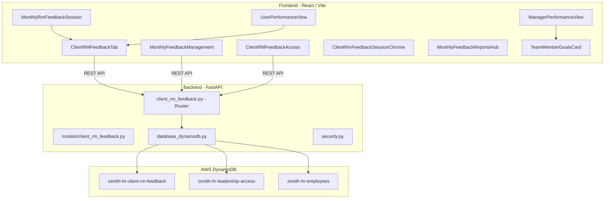
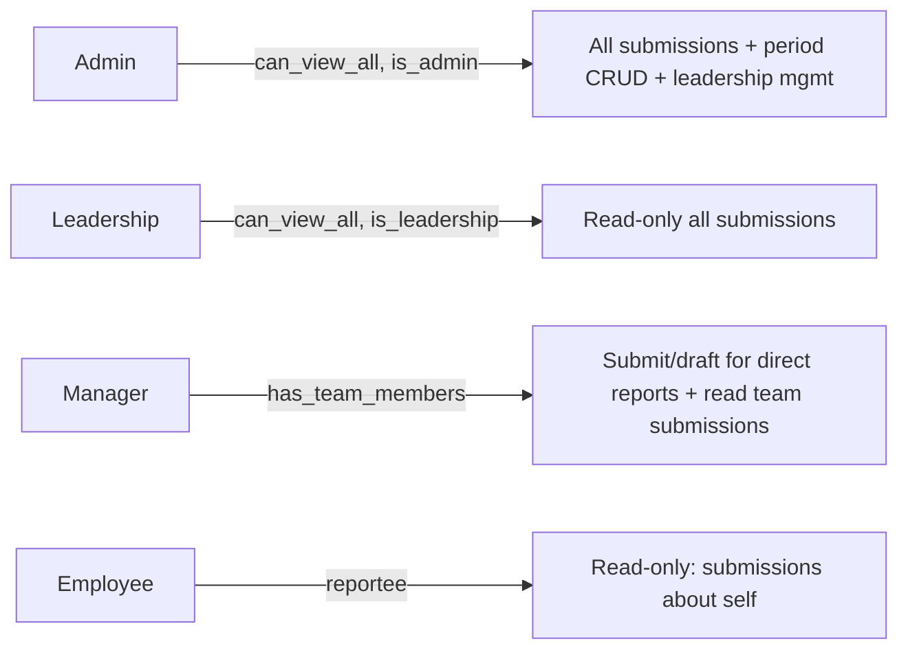

# Client RM Feedback – Deep Architecture Analysis

> Complete system analysis of the **Monthly feedback** (Client Reporting Manager Feedback) feature in Zenith HR Pulse.

---

## 1. High-Level Architecture



---

## 2. DynamoDB Tables

### 2.1 Primary Table: `zenith-hr-client-rm-feedback-{stage}`

This is a **single-table design** storing three entity types (`period`, `submission`, `draft`) discriminated by the `entity_type` attribute.

| Attribute | Type | Purpose |
|---|---|---|
| **`id`** (PK) | String | UUID primary key (HASH) |
| `entity_type` | String | Discriminator: `"period"` / `"submission"` / `"draft"` |
| `period_id` | String | Links submissions/drafts to their period |
| `employee_id` | String | Subject employee (the reportee) |
| `manager_employee_id` | String | Manager who submitted |

**GSIs defined in serverless.yml (L930-973):**

| Index Name | Partition Key | Defined? | Actually Used in Code? |
|---|---|---|---|
| `EntityTypeIndex` | `entity_type` | Yes | **NO** |
| `PeriodIndex` | `period_id` | Yes | **NO** |
| `EmployeeIndex` | `employee_id` | Yes | **NO** |
| `ManagerIndex` | `manager_employee_id` | Yes | **NO** |

> **⚠️ WARNING: All four GSIs are defined in CloudFormation but completely unused.** Every query in the backend router uses full-table `_scan_full()` with `FilterExpression` instead. This is a major scaling concern — the TODO comment at router line 651 explicitly calls this out.

#### Entity: `period`

```json
{
  "id": "uuid",
  "entity_type": "period",
  "period_id": "uuid",
  "label": "April 2026",
  "start_date": "2026-04-01",
  "end_date": "2026-04-30",
  "period_status": "draft | open | closed",
  "created_at": "ISO-8601",
  "updated_at": "ISO-8601",
  "created_by_email": "admin@company.com"
}
```

#### Entity: `submission`

```json
{
  "id": "uuid (same as submission_id)",
  "entity_type": "submission",
  "submission_id": "uuid",
  "period_id": "uuid",
  "employee_id": "uuid (reportee)",
  "employee_name": "John Doe",
  "employee_code": "EMP001",
  "employee_email": "john@company.com",
  "manager_employee_id": "uuid",
  "manager_email": "mgr@company.com",
  "manager_name": "Jane Manager",
  "billing_status": "billable | non_billable | internal",
  "client_name": "",
  "project_name": "",
  "client_reporting_manager_name": "",
  "client_manager_name": "Client PM",
  "client_manager_email": "pm@client.com",
  "info_services_reporting_manager_name": "Jane Manager",
  "ratings": {
    "quality_of_deliverables": 4,
    "adherence_to_deadlines": 3,
    "technical_competency": 5,
    "problem_solving_skills": 4,
    "productivity_efficiency": 4,
    "accuracy_attention_to_detail": 3,
    "ability_to_work_independently": 5,
    "understanding_of_requirements": 4,
    "responsiveness_to_work_assignments": 4,
    "clarity_in_communication": 5,
    "responsiveness_to_emails_calls": 4,
    "understanding_of_requirements_2": 3,
    "status_reporting_updates": 4,
    "team_collaboration": 5,
    "participation_in_discussions": 4
  },
  "additional_feedback": "Free-form text",
  "overall_satisfaction": 4,
  "started_at": "ISO",
  "submitted_at": "ISO",
  "updated_at": "ISO",
  "is_submitted": true,
  "is_active": true,
  "reportee_seen": false
}
```

#### Entity: `draft`

Same shape as submission but with:
- `entity_type: "draft"`, `draft_id` instead of `submission_id`
- `is_active: true` (set to `false` when archived after submit)
- No `is_submitted`, no `submitted_at`
- `saved_at` timestamp instead

---

### 2.2 Access Control Table: `zenith-hr-leadership-access-{stage}`

| Attribute | Type | Purpose |
|---|---|---|
| **`id`** (PK) | String | UUID primary key |
| `email` | String | Normalized email of the leadership viewer |

**GSI:** `EmailIndex` on `email` — **this one IS used** by `_is_leadership_email()` (with scan fallback for local dev).

```json
{
  "id": "uuid",
  "email": "leader@company.com",
  "created_at": "ISO",
  "updated_at": "ISO",
  "created_by_email": "admin@company.com",
  "is_active": true
}
```

---

### 2.3 Referenced Table: `zenith-hr-employees-{stage}`

The CRM feedback feature reads from this table but does not write to it. Used for:
- Looking up the logged-in user's employee record (`_get_employee_by_email` via `EmailIndex`)
- Finding direct reports via `reporting_to` field (`_get_direct_reports` via `ReportingToIndex`)
- Enriching submission records with `employee_email` on legacy rows
- Validating that leadership access is granted only to active directory employees

---

## 3. API Endpoints (14 total)

Router prefix: `/api/client-rm-feedback`

| # | Method | Path | Auth | Purpose |
|---|---|---|---|---|
| 1 | `GET` | `/me-context` | User | Returns caller's role context (employee_id, team, leadership, admin, reportees) |
| 2 | `GET` | `/access/leadership` | **Admin** | List all leadership access entries with enriched employee snapshots |
| 3 | `POST` | `/access/leadership?email=` | **Admin** | Grant leadership access (validates employee exists + active) |
| 4 | `DELETE` | `/access/leadership?email=` | **Admin** | Revoke leadership access |
| 5 | `POST` | `/periods` | **Admin** | Create a feedback period (only one "open" at a time) |
| 6 | `GET` | `/periods` | User | List all periods (sorted by start_date desc) |
| 7 | `PUT` | `/periods/{period_id}` | **Admin** | Update period (label/dates/status) |
| 8 | `GET` | `/drafts/active` | User | Get active draft for (period, employee, manager) triple |
| 9 | `PUT` | `/drafts/active` | User | Upsert draft for a reportee (auto-save) |
| 10 | `POST` | `/submissions` | User | Submit final feedback (validates direct-report, period open, no duplicate) |
| 11 | `GET` | `/submissions` | User | List submissions (scoped by role) |
| 12 | `PUT` | `/submissions/{id}` | User | **Always returns 409** — submitted feedback is immutable |
| 13 | `POST` | `/submissions/{id}/mark-seen` | User | Mark submission as "seen" by the reportee |
| 14 | `GET` | `/notifications/summary` | User | Returns notification counts (pending, unread, open periods) |

---

## 4. Access Control Model (4 tiers)



| Role | How Determined | Capabilities |
|---|---|---|
| **Admin** | `current_user.get("is_admin")` from auth token | Period CRUD, leadership access management, view all submissions |
| **Leadership** | Email in `leadership-access` table | Read-only view of ALL submissions org-wide |
| **Manager** | Has employees with `reporting_to` pointing to them | Submit/draft feedback for direct reports, read team submissions |
| **Employee** | Base role | Read-only: can see submissions where they are the subject |

---

## 5. Frontend Component Map

| Component | File | Role |
|---|---|---|
| **ClientRMFeedbackTab** | `src/components/performance/ClientRMFeedbackTab.tsx` | Core: submit form + read-only view (2050 lines) |
| **MonthlyFeedbackManagement** | `src/components/performance/MonthlyFeedbackManagement.tsx` | Admin/leadership dashboard with CSV export (1118 lines) |
| **ClientRMFeedbackAccess** | `src/components/admin/ClientRMFeedbackAccess.tsx` | Admin panel for leadership access (546 lines) |
| **MonthlyRmFeedbackSession** | `src/pages/MonthlyRmFeedbackSession.tsx` | Dedicated session page for manager submit (228 lines) |
| **ClientRmFeedbackSessionChrome** | `src/components/performance/ClientRmFeedbackSessionChrome.tsx` | Breadcrumbs + back navigation shell (83 lines) |
| **MonthlyFeedbackReportsHub** | `src/components/performance/MonthlyFeedbackReportsHub.tsx` | Reports page breadcrumbs (49 lines) |

### Entry Points

1. **Performance → My Team → "Monthly feedback"** button on TeamMemberGoalsCard → navigates to `MonthlyRmFeedbackSession`
2. **Performance → My Goals** → `ClientRMFeedbackTab` with `clientRmSurface="self"` (read-only)
3. **Header → "Monthly feedback"** → `/performance/monthly-feedback` → `MonthlyFeedbackManagement` (admin/leadership)
4. **Admin Portal → "Leadership Access"** → `ClientRMFeedbackAccess`

---

## 6. Rating System (15 criteria + overall)

### Work Performance (9 criteria)

Scale: Poor (1) → Needs Improvement (2) → Meets Expectations (3) → Exceeds Expectations (4) → Outstanding (5)

| # | Key | Label |
|---|---|---|
| 1 | `quality_of_deliverables` | Quality of Deliverables |
| 2 | `adherence_to_deadlines` | Adherence to Deadlines |
| 3 | `technical_competency` | Technical Competency |
| 4 | `problem_solving_skills` | Problem-Solving Skills |
| 5 | `productivity_efficiency` | Productivity and Efficiency |
| 6 | `accuracy_attention_to_detail` | Accuracy and Attention to Detail |
| 7 | `ability_to_work_independently` | Ability to Work Independently |
| 8 | `understanding_of_requirements` | Understanding of Requirements |
| 9 | `responsiveness_to_work_assignments` | Responsiveness to Work Assignments |

### Communication and Collaboration (6 criteria)

Scale: Limited Effectiveness (1) → Developing (2) → Meets Expectations (3) → Exceeds Expectations (4) → Exceptional (5)

| # | Key | Label |
|---|---|---|
| 10 | `clarity_in_communication` | Clarity in Communication |
| 11 | `responsiveness_to_emails_calls` | Responsiveness to Emails/Calls |
| 12 | `understanding_of_requirements_2` | Understanding of Requirements (secondary) |
| 13 | `status_reporting_updates` | Status Reporting and Updates |
| 14 | `team_collaboration` | Team Collaboration |
| 15 | `participation_in_discussions` | Participation in Discussions |

### Overall Satisfaction: 1-5 stars (separate from criteria ratings)

> **Note:** Field `understanding_of_requirements_2` has a legacy alias `business_domain_understanding`. Both the frontend `pickRating()` and CSV export handle this mapping.

---

## 7. Key Business Rules

| Rule | Implementation | Location |
|---|---|---|
| **One open period at a time** | Scans for existing open period; returns 409 if found | Router L344-352 |
| **Manager to direct report only** | `_is_direct_report()` validates `reporting_to` relationship | Router L407-410 |
| **Immutable submissions** | `PUT /submissions/{id}` always returns 409 | Router L633-648 |
| **Draft auto-save** | Frontend saves every 25s if dirty; signature-based dedup | Tab L1304-1327 |
| **Draft archival on submit** | Active drafts set to `is_active=false` on successful submit | Router L611-628 |
| **Duplicate prevention** | Scans for existing active submission for same triple | Router L553-567 |
| **Reportee seen tracking** | `reportee_seen=false` on create; flipped via mark-seen | Router L704-722 |
| **Inactive employees excluded** | `_get_direct_reports()` filters `status=inactive` | Router L189 |
| **Email normalization** | All emails lowered + trimmed | Router L39-40 |
| **Leadership = directory only** | Validates email exists + employee active before granting | Router L278-288 |

---

## 8. Notification Summary Logic

The `GET /notifications/summary` endpoint returns:

| Counter | How Computed |
|---|---|
| `manager_pending_count` | Direct reports WITHOUT a submission in any open period (by this manager) |
| `reportee_unread_count` | Submissions about current user where `reportee_seen=false` |
| `hr_new_count` | Total submissions in open periods (admin/leadership only) |
| `leadership_new_count` | Same as hr_new_count if user is leadership |
| `open_period_count` | Count of periods with `period_status=open` |

> **⚠️ PERFORMANCE:** This endpoint does **two full table scans** (submissions + periods) plus a `_get_direct_reports()` call on every invocation.

---

## 9. CSV Export System

The `MonthlyFeedbackManagement` component provides CSV export with:

- **30 columns** including ID, emails, employee info, billing, all 15 ratings (as text labels), feedback, and overall satisfaction (numeric)
- **Two export modes**: "All visible" or "Selected rows only" (checkbox)
- **Audit filename**: `monthly_feedback_{period}_{count}rows_{mode}_{UTC-timestamp}.csv`
- **Rating labels**: Work performance as text (e.g., "Meets Expectations"), overall stays numeric 1-5

---

## 10. Known Technical Debt

### 10.1 Full Table Scans (Critical)
Every query uses `_scan_full()` with `FilterExpression`. The 4 defined GSIs are unused. This will degrade significantly past ~1000 items.

### 10.2 Single-Table Design Without Composite Keys
The table uses simple `id` HASH key with `entity_type` as a regular attribute. A proper design would use composite keys enabling efficient index queries.

### 10.3 Deprecated Fields
`client_name`, `project_name`, `client_reporting_manager_name` are deprecated from UI but kept as empty defaults for backward compatibility.

### 10.4 Notification Performance
`get_notification_summary()` runs two full table scans plus employee lookups on every page load.

---

## 11. Complete File Index

### Backend

| File | Lines | Purpose |
|---|---|---|
| `backend/app/routers/client_rm_feedback.py` | 774 | Router with all 14 endpoints |
| `backend/app/models/client_rm_feedback.py` | 93 | Pydantic models (6 schemas) |
| `backend/app/database_dynamodb.py` | 409 | Table helpers (L288-295 for CRM tables) |
| `backend/serverless.yml` | 1099 | CloudFormation table + GSI definitions (L930-994) |

### Frontend

| File | Lines | Purpose |
|---|---|---|
| `src/components/performance/ClientRMFeedbackTab.tsx` | 2050 | Main component: submit form + read-only view |
| `src/components/performance/MonthlyFeedbackManagement.tsx` | 1118 | Admin/leadership dashboard with CSV export |
| `src/components/admin/ClientRMFeedbackAccess.tsx` | 546 | Admin panel for leadership access |
| `src/pages/MonthlyRmFeedbackSession.tsx` | 228 | Session page for manager submit |
| `src/components/performance/ClientRmFeedbackSessionChrome.tsx` | 83 | Breadcrumbs and navigation shell |
| `src/components/performance/MonthlyFeedbackReportsHub.tsx` | 49 | Reports page breadcrumbs |
| `src/lib/client-rm-feedback-routes.ts` | 59 | Route constants + back-navigation helpers |
| `src/lib/client-rm-feedback-rating-scales.ts` | 73 | Rating scale labels + CSV export formatters |
